# System Flow Diagrams

## 1. Complete System Overview — From Login to All Features

```mermaid
flowchart TB
    START([User Opens App]) --> AUTH{Authentication}

    %% ─── Authentication ───
    AUTH -->|Email / Password| LOGIN[Login Form]
    AUTH -->|SSO| SSO_PROVIDER[Google / Microsoft Entra]
    LOGIN --> VALIDATE{Valid Credentials?}
    SSO_PROVIDER --> SSO_CB[SSO Callback]
    SSO_CB --> TOKEN[Issue Sanctum Token]
    VALIDATE -->|No| LOGIN
    VALIDATE -->|Yes| TOKEN
    TOKEN --> ROLE{User Role?}

    %% ─── Role-Based Routing ───
    ROLE -->|End-User| PORTAL[Self-Service Portal]
    ROLE -->|Agent| COCKPIT[Agent Workspace]
    ROLE -->|Admin| ADMIN[Admin Panel]

    %% ═══════════════════════════════════════
    %% END-USER JOURNEY
    %% ═══════════════════════════════════════
    subgraph ENDUSER ["🧑 End-User Journey"]
        PORTAL --> P_DASH[Portal Dashboard]
        P_DASH --> P_KB[Search Knowledge Base]
        P_DASH --> P_DEVICES[My Devices]
        P_DASH --> P_TICKETS[My Tickets]
        P_DASH --> P_PROFILE[My Profile]
        P_DASH --> P_NEW[New Request]

        P_KB --> KB_RESULT{Found Answer?}
        KB_RESULT -->|Yes| KB_VIEW[View Article]
        KB_RESULT -->|No| P_NEW

        P_NEW --> CATALOG[Service Catalog Tiles]
        CATALOG --> CATEGORY[Select Category]
        CATEGORY --> FORM[Dynamic Ticket Form]
        FORM --> SUGGEST[KB Article Suggestions]
        SUGGEST -->|Solved| KB_VIEW
        SUGGEST -->|Not Solved| ATTACH[Attach Files]
        ATTACH --> SUBMIT[Submit Ticket ≤ 3 Clicks]
        SUBMIT --> DUPE{Duplicate Detected?}
        DUPE -->|Yes| WARN[Show Warning]
        WARN -->|Submit Anyway| CREATE_TKT
        DUPE -->|No| CREATE_TKT[Create Ticket TKT-XXXXX]
        CREATE_TKT --> ACK_EMAIL[📧 Auto-Acknowledgement Email]
        CREATE_TKT --> NOTIFY_AGENT[🔔 Notify Assigned Agent]
        CREATE_TKT --> AUTO_ROUTE[⚙️ Automation Engine Routes]

        P_TICKETS --> TKT_LIST[Ticket List with Status]
        TKT_LIST --> TKT_DETAIL_U[View Ticket Thread]
        TKT_DETAIL_U --> REPLY_U[Add Reply]
        TKT_DETAIL_U --> TRACKER[Status Progress Bar]

        P_DEVICES --> DEV_LIST[View Assigned Assets]
    end

    %% ═══════════════════════════════════════
    %% AGENT JOURNEY
    %% ═══════════════════════════════════════
    subgraph AGENT ["🛠️ Agent Journey"]
        COCKPIT --> A_INBOX[Unified Inbox — Real-Time]
        COCKPIT --> A_KANBAN[Kanban Board]
        COCKPIT --> A_KB[Manage KB Articles]
        COCKPIT --> A_ASSETS[Manage Assets]
        COCKPIT --> A_CANNED[Canned Responses]

        A_INBOX --> CLAIM[Claim / Assign Ticket]
        A_KANBAN --> DRAG[Drag to Change Status]

        CLAIM --> TKT_DETAIL_A[Ticket Detail View]
        DRAG --> TKT_DETAIL_A

        TKT_DETAIL_A --> COLLISION{Another Agent Viewing?}
        COLLISION -->|Yes| COLLISION_WARN[⚠️ Collision Warning]
        COLLISION -->|No| EDIT_TKT

        COLLISION_WARN --> EDIT_TKT[Edit Ticket]
        EDIT_TKT --> REPLY_PUB[Public Reply]
        EDIT_TKT --> REPLY_INT[Internal Note]
        EDIT_TKT --> MACRO[Quick Macro Action]
        EDIT_TKT --> MERGE[Merge Tickets]
        EDIT_TKT --> TIME_LOG[Log Time Spent]
        EDIT_TKT --> CHANGE_STATUS[Change Status]
        EDIT_TKT --> ESCALATE[Escalate to L2/L3]

        REPLY_PUB --> NOTIFY_USER[📧 Email + 🔔 Notify User]
        CHANGE_STATUS --> SLA_CHECK{SLA Breached?}
        SLA_CHECK -->|Yes| SLA_ALERT[🔴 SLA Alert + Escalation]
        SLA_CHECK -->|No| SLA_OK[🟢 On Track]

        ESCALATE --> NEXT_TIER[Assign Next Escalation Tier]
        NEXT_TIER --> NOTIFY_TEAM[🔔 Notify Escalation Team]

        A_KB --> KB_EDIT[Create / Edit Article]
        KB_EDIT --> KB_VERSION[Version Saved]

        A_ASSETS --> ASSET_ASSIGN[Assign Asset to User]
        ASSET_ASSIGN --> ASSET_HISTORY[Ownership History Logged]
    end

    %% ═══════════════════════════════════════
    %% ADMIN JOURNEY
    %% ═══════════════════════════════════════
    subgraph ADMINPANEL ["👑 Admin Journey"]
        ADMIN --> AD_USERS[User Management]
        ADMIN --> AD_RULES[Automation Rules]
        ADMIN --> AD_SLA[SLA Policies]
        ADMIN --> AD_ESC[Escalation Tiers]
        ADMIN --> AD_SETTINGS[System Settings]
        ADMIN --> AD_REPORTS[Reports & Analytics]
        ADMIN --> AD_CUSTOM[Custom Fields]
        ADMIN --> AD_INTEGRATIONS[Integrations Setup]
        ADMIN --> AD_HEALTH[System Health]
        ADMIN --> AD_AUDIT[Activity Log]

        AD_RULES --> RULE_BUILDER[Rule Builder UI]
        RULE_BUILDER --> CONDITION[IF Condition Group]
        CONDITION --> ACTION[THEN Action]
        ACTION --> PREVIEW[Preview / Dry-Run]

        AD_SLA --> SLA_CONFIG[Response + Resolution Times per Priority]
        AD_ESC --> TIER_CONFIG[L1 → L2 → L3 Team Assignment]

        AD_REPORTS --> DASH_KPI[KPI Cards]
        AD_REPORTS --> DASH_HEAT[Volume Heatmap]
        AD_REPORTS --> DASH_SLA[SLA Compliance Gauge]
        AD_REPORTS --> DASH_CSAT[CSAT Score Trend]
        AD_REPORTS --> DASH_AGENT[Agent Leaderboard]
        AD_REPORTS --> EXPORT[Export CSV / Excel]

        AD_SETTINGS --> SET_BRAND[Branding / Logo]
        AD_SETTINGS --> SET_HOURS[Business Hours]
        AD_SETTINGS --> SET_HOLIDAYS[Holidays Calendar]

        AD_INTEGRATIONS --> INT_SLACK[Slack Webhook Config]
        AD_INTEGRATIONS --> INT_TEAMS[Teams Webhook Config]
        AD_INTEGRATIONS --> INT_EMAIL[Email-to-Ticket Config]

        AD_HEALTH --> HEALTH_DB[(Database ✅)]
        AD_HEALTH --> HEALTH_REDIS[(Redis ✅)]
        AD_HEALTH --> HEALTH_QUEUE[(Queue Worker ✅)]
    end

    %% ═══════════════════════════════════════
    %% AUTOMATION ENGINE (background)
    %% ═══════════════════════════════════════
    subgraph AUTOMATION ["⚙️ Automation Engine — Background"]
        AUTO_ROUTE --> MATCH{Rule Matches?}
        MATCH -->|Yes| EXEC[Execute Actions]
        EXEC --> A_ASSIGN[Auto-Assign Agent/Team]
        EXEC --> A_PRIORITY[Auto-Set Priority]
        EXEC --> A_RESPONSE[Send Auto-Response]
        EXEC --> A_APPROVAL[Request Approval]
        EXEC --> A_WEBHOOK[Fire Webhook]
        EXEC --> AUDIT_LOG[📝 Audit Log Entry]
        MATCH -->|No| SKIP[No Action]

        A_APPROVAL --> APPROVAL_Q[Approval Queue]
        APPROVAL_Q --> APPROVE{Approved?}
        APPROVE -->|Yes| PROCEED[Ticket Proceeds]
        APPROVE -->|No| REJECT[Return to Requester]
    end

    %% ═══════════════════════════════════════
    %% MULTI-CHANNEL INPUTS
    %% ═══════════════════════════════════════
    subgraph CHANNELS ["📡 Multi-Channel Ticket Sources"]
        CH_WEB([🌐 Web Portal]) --> CREATE_TKT
        CH_EMAIL([📧 Inbound Email]) --> PARSE_EMAIL[Parse Email]
        PARSE_EMAIL --> CREATE_TKT
        CH_SLACK([💬 Slack Command]) --> SLACK_CMD[/ticket Create]
        SLACK_CMD --> CREATE_TKT
        CH_TEAMS([💬 Teams Message]) --> TEAMS_CMD[Create from Teams]
        TEAMS_CMD --> CREATE_TKT
    end

    %% ═══════════════════════════════════════
    %% NOTIFICATIONS
    %% ═══════════════════════════════════════
    subgraph NOTIF ["🔔 Notification System"]
        NOTIFY_AGENT --> N_INAPP[In-App Bell]
        NOTIFY_AGENT --> N_EMAIL_A[Agent Email]
        NOTIFY_AGENT --> N_SLACK_A[Slack DM]

        NOTIFY_USER --> N_INAPP_U[In-App Bell]
        NOTIFY_USER --> N_EMAIL_U[User Email]
    end

    %% ═══════════════════════════════════════
    %% TICKET LIFECYCLE
    %% ═══════════════════════════════════════
    subgraph LIFECYCLE ["📋 Ticket Lifecycle"]
        direction LR
        S_NEW([🔵 New]) --> S_PROGRESS([🟡 In Progress])
        S_PROGRESS --> S_WAITING([🟠 Waiting on Customer])
        S_WAITING --> S_PROGRESS
        S_PROGRESS --> S_RESOLVED([🟢 Resolved])
        S_RESOLVED -->|72h Auto-Close| S_CLOSED([⚫ Closed])
        S_CLOSED --> CSAT_SURVEY[📊 Send CSAT Survey]
    end

    %% Styling
    style ENDUSER fill:#1e3a5f,stroke:#4a90d9,color:#ffffff
    style AGENT fill:#2d4a2d,stroke:#5cb85c,color:#ffffff
    style ADMINPANEL fill:#5a2d5a,stroke:#9b59b6,color:#ffffff
    style AUTOMATION fill:#4a3728,stroke:#e67e22,color:#ffffff
    style CHANNELS fill:#1a3a4a,stroke:#3498db,color:#ffffff
    style NOTIF fill:#3a1a1a,stroke:#e74c3c,color:#ffffff
    style LIFECYCLE fill:#2a2a2a,stroke:#95a5a6,color:#ffffff
```

---

## 2. Authentication Flow — Detailed

```mermaid
sequenceDiagram
    actor User
    participant Browser as Vue.js SPA
    participant API as Laravel API
    participant DB as MySQL Percona
    participant SSO as Google / Microsoft
    participant Mail as Email Service

    Note over User,Mail: === Standard Login ===
    User->>Browser: Enter email + password
    Browser->>API: POST /api/v1/auth/login
    API->>DB: Verify credentials (bcrypt)
    alt Valid
        DB-->>API: User record
        API->>DB: Create personal_access_token
        API-->>Browser: 200 { token, user }
        Browser->>Browser: Store in Pinia + localStorage
        Browser-->>User: Redirect to dashboard
    else Invalid
        API-->>Browser: 401 Unauthorized
        Browser-->>User: Show error message
    end

    Note over User,Mail: === SSO Login ===
    User->>Browser: Click "Sign in with Google"
    Browser->>API: GET /api/v1/auth/sso/google/redirect
    API-->>Browser: 302 Redirect to Google
    Browser->>SSO: OAuth consent screen
    SSO-->>Browser: Redirect with auth code
    Browser->>API: GET /api/v1/auth/sso/google/callback?code=xxx
    API->>SSO: Exchange code for token
    SSO-->>API: User profile (email, name)
    API->>DB: Find or create user
    API->>DB: Create personal_access_token
    API-->>Browser: 200 { token, user }

    Note over User,Mail: === Forgot Password ===
    User->>Browser: Click "Forgot Password?"
    Browser->>API: POST /api/v1/auth/forgot-password { email }
    API->>DB: Generate reset token
    API->>Mail: Send reset link email
    Mail-->>User: 📧 Password reset email
    User->>Browser: Click reset link
    Browser->>API: POST /api/v1/auth/reset-password { token, password }
    API->>DB: Verify token + update password
    API-->>Browser: 200 Password reset successful
```



---

## 3. Ticket Lifecycle Flow

```mermaid
stateDiagram-v2
    [*] --> New : Ticket Created
    New --> InProgress : Agent Claims / Assigned
    InProgress --> WaitingOnCustomer : Agent requests info
    WaitingOnCustomer --> InProgress : Customer replies
    WaitingOnCustomer --> InProgress : 48h nudge sent
    InProgress --> PendingApproval : Approval required
    PendingApproval --> InProgress : Approved
    PendingApproval --> New : Rejected — returned
    InProgress --> Resolved : Agent resolves
    Resolved --> InProgress : Customer reopens
    Resolved --> Closed : 72h auto-close
    Closed --> [*]
    Closed --> CSATSurvey : Send satisfaction survey
    CSATSurvey --> [*]

    note right of New
        🔵 SLA timer starts
        ⚙️ Automation rules evaluate
        📧 Auto-acknowledgement sent
        🔔 Agent notified
    end note

    note right of InProgress
        🟡 First-response timestamp recorded
        📊 SLA tracking active
        🔴 Escalation if SLA approaching
    end note

    note right of Resolved
        🟢 Resolution time calculated
        ⏰ 72h countdown to auto-close
    end note

    note right of Closed
        ⚫ CSAT survey dispatched
        📊 Metrics finalised
    end note
```



---

## 4. Data Flow — How Modules Connect

```mermaid
flowchart LR
    subgraph INPUT ["Inputs"]
        WEB[🌐 Web Portal]
        EMAIL[📧 Email]
        SLACK[💬 Slack]
        TEAMS[💬 Teams]
    end

    subgraph CORE ["Core System"]
        AUTH[🔐 Auth Module 1]
        TICKETS[🎫 Tickets Module 2+3]
        AUTO[⚙️ Automation Module 4]
        KB[📚 KB Module 5]
        ASSETS[💻 Assets Module 6]
    end

    subgraph OUTPUT ["Outputs"]
        REPORTS[📈 Reports Module 7]
        NOTIF[🔔 Notifications Module 8]
        SETTINGS[⚙️ Settings Module 9]
    end

    subgraph DATA ["Data Layer"]
        DB[(MySQL Percona)]
        REDIS[(Redis Cache)]
        QUEUE[Queue Worker]
        STORAGE[File Storage]
    end

    WEB --> AUTH
    EMAIL --> TICKETS
    SLACK --> TICKETS
    TEAMS --> TICKETS

    AUTH --> TICKETS
    TICKETS --> AUTO
    AUTO --> TICKETS
    KB --> TICKETS
    ASSETS --> TICKETS

    TICKETS --> REPORTS
    TICKETS --> NOTIF
    AUTO --> NOTIF
    SETTINGS --> AUTO

    TICKETS --> DB
    KB --> DB
    ASSETS --> DB
    AUTH --> DB
    REPORTS --> DB

    TICKETS --> STORAGE
    KB --> REDIS
    SETTINGS --> REDIS
    REPORTS --> QUEUE
    NOTIF --> QUEUE
```


